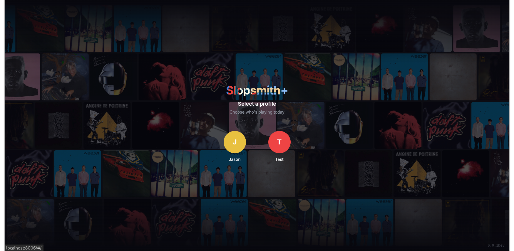
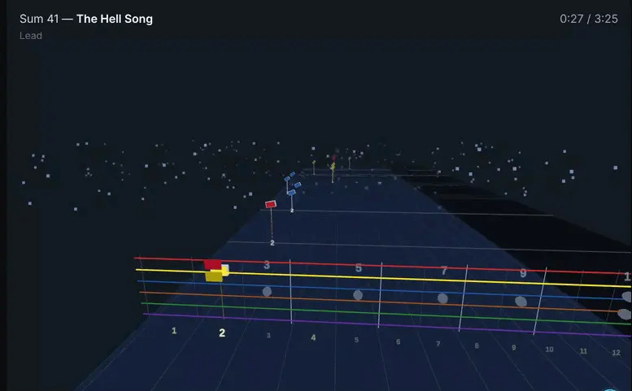
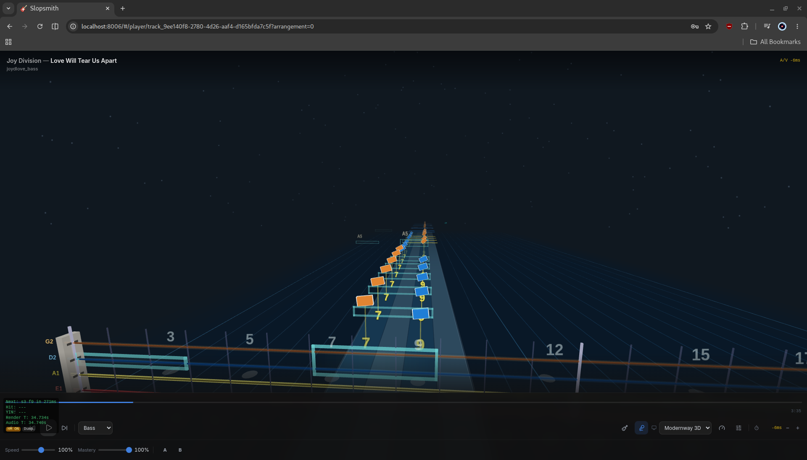

# Sloprock Plus

Sloprock Plus is a self-hosted guitar practice app that runs in your browser. Load your song library, follow along on a scrolling note highway, slow sections down, loop tricky parts, and track your progress — no internet required after setup.



[](https://www.youtube.com/watch?v=f_XTS9tVeaU)

| | |
|---|---|
|  |  |
|  |  |

---

## Contents

- [Get Started](#get-started)
- [What You Can Do](#what-you-can-do)
- [Companion App — VST Support](#companion-app--vst-support)
- [Coming Soon](#coming-soon)
- [Settings](#settings)
- [Self-Hosting](#self-hosting)
  - [Docker Compose](#docker-compose)
  - [Apache Reverse Proxy](#apache-reverse-proxy)
  - [Portainer](#portainer)
- [Reporting a Bug](#reporting-a-bug)
- [Tech Stack](#tech-stack)
- [License](#license)

---

## Get Started

You need [Docker](https://docs.docker.com/get-docker/) installed — that's it.

```bash
git clone https://github.com/johncoco12/SlopRock-Plus
cd sloprock-plus
docker compose up -d
```

Then open **http://localhost:8006** in your browser.

> Everything runs locally on your machine. Nothing is sent to the cloud.

---

## What You Can Do

### Browse Your Library

Find songs fast — browse by artist or album, filter by tuning or arrangement type, sort by year or recently added, and heart-mark your favorites. Edit song info and cover art directly in the app. Handles libraries of 80,000+ songs without slowing down.

### Play Along on a Note Highway

Songs scroll through a note highway in real time — just like Guitar Hero or *REDACTED*. Two visual styles are available: a **3D highway** (beta) with lighting and depth, or a **classic 2D highway** for older devices.

All standard guitar techniques are shown on screen — bends, slides, hammer-ons, pull-offs, palm mutes, harmonics, and more. Lyrics scroll in sync if the song includes them.

The mic listens while you play and highlights notes as you hit them correctly.

### Practice at Your Own Pace

- **Slow it down** — speed slider from 25% to 150%
- **Loop any section** — set a start and end point to repeat a tricky passage
- **Swap arrangements** mid-song between Lead, Rhythm, and Bass

### Multiple Profiles

Set up separate profiles for different users — each with their own settings, saved loops, and scores. Profiles can be protected with a PIN. Admin and regular-user access levels are supported.

### Themes & Plugins

Pick from 9 built-in color themes or install plugins to add extra features. Plugins that ship with the app include a leaderboard for tracking scores and additional song format support.

---

## Companion App — VST Support

**SlopAudio Connect** is a small desktop app you install alongside Sloprock. It gives the browser app direct access to your audio interface, enabling VST amp sims and low-latency pitch detection — things a browser alone can't do.

> **Download:** [github.com/johncoco12/SlopAudio-Connect](https://github.com/johncoco12/SlopAudio-Connect)

---

## Coming Soon

| Feature | Status |
|---------|--------|
| Saved practice loops (named, per-song) | Planned |
| Metronome count-in before loops | Planned |
| Smooth rewind to loop start | Planned |
| Import Guitar Pro tabs and convert to playable songs | In development |

---

## Settings

Most options live inside the app under **Settings**. You can change your song folder, default arrangement, and more without touching any config files.

For server-level options (useful when running behind a reverse proxy or on a home server), edit the environment variables in `docker-compose.yml`:

| Variable | What it does |
|----------|--------------|
| `SAC_SERVER_NAME` | The name shown to SlopAudio Connect on your local network |
| `SAC_SERVER_IP` | Override the IP address advertised to the companion app — helpful if auto-detection picks a VPN or Docker address instead of your real one |
| `SAC_HTTP_PORT` | The port advertised to the companion app — set this if a reverse proxy changes the port |
| `LOG_LEVEL` | How much detail appears in server logs (`info` is the default; use `debug` for troubleshooting) |

---

## Self-Hosting

### Docker Compose

The `docker-compose.yml` in this repo is ready to use as-is. To run it:

```bash
docker compose up -d
```

To change ports or passwords, open `docker-compose.yml` in a text editor and adjust the values before starting.

**What gets started:**

| | Port | Purpose |
|--|------|---------|
| App (browser) | `8006` | The main interface you open in your browser |
| Backend | `8085` | API and real-time updates |
| Database | `5432` | Stores your song library |
| File storage | `9000` | Stores cover art and audio files |
| Storage admin | `9001` | MinIO dashboard (advanced) |

### Apache Reverse Proxy

Use this if you want Sloprock available at a custom domain on an existing web server.

```bash
sudo a2enmod proxy proxy_http proxy_wstunnel
sudo systemctl restart apache2
```

Add to your virtual host config:

```apache
ProxyPass /sloprock/ http://localhost:8006/
ProxyPassReverse /sloprock/ http://localhost:8006/

ProxyPass /api/    http://localhost:8085/api/
ProxyPassReverse /api/ http://localhost:8085/api/

ProxyPass /ws      ws://localhost:8085/ws

ProxyPass /static/ http://localhost:8085/static/
ProxyPassReverse /static/ http://localhost:8085/static/

ProxyPass /audio/  http://localhost:8085/audio/
ProxyPassReverse /audio/ http://localhost:8085/audio/
```

> Sloprock expects to live at the root of a domain. A dedicated subdomain like `sloprock.your-domain.com` avoids conflicts with other sites.

### Portainer

Portainer is a visual dashboard for managing Docker on a home server — a good choice if you're not comfortable with the command line.

**1. Install Docker**
```bash
sudo apt update && sudo apt install docker.io -y
sudo usermod -aG docker $USER
```

**2. Install Portainer**
```bash
docker run -d -p 8888:9000 --restart always \
  -v /var/run/docker.sock:/var/run/docker.sock \
  portainer/portainer-ce:latest
```

**3.** Open `http://server-ip:8888` and create your admin account.

**4.** Create a new Stack and paste in the contents of `docker-compose.yml`.

**5.** Access Sloprock at `http://server-ip:8006`.

**6.** Install recommended plugins from **Settings → Plugins**:
- **NAM Tone Engine** — connects your guitar/audio interface. Amp models available at [tone3000.com](https://www.tone3000.com/)
- **Note Detection** — enables real-time pitch detection while you play

---

## Reporting a Bug

Go to **Settings → Diagnostics → Export Diagnostics**. This creates a zip file with logs, hardware info, and browser errors — everything needed to reproduce the issue. Attach it when opening a GitHub issue.

---

## Tech Stack

| Layer | Technology |
|-------|------------|
| Frontend | Vue 3 · TypeScript · Three.js · TresJS · Pinia · Tailwind CSS |
| Backend | Node.js 20 · Fastify · TypeScript · Prisma ORM |
| Database | PostgreSQL 16 |
| Object Storage | MinIO (S3-compatible) |
| Real-time | WebSocket |
| Note Detection | YIN algorithm → WASM |
| Audio Processing | FFmpeg · FluidSynth · vgmstream · rubberband |
| Container | Docker · Docker Compose |

---

## License

Sloprock Plus is licensed under the [GNU Affero General Public License v3.0](LICENSE) (AGPL-3.0-only).

Free to use, modify, and self-host. If you distribute or publicly host a modified version, you must release the source under the same license. See [CONTRIBUTING.md](CONTRIBUTING.md) for contributor terms.
